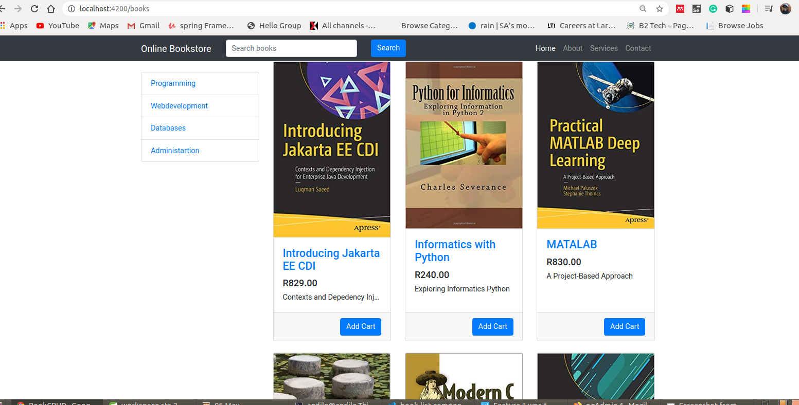

Spring 4 MVC 
===============================
# STILL A WORK IN PROGRESS APPLICATION...


	```
-	Home page with the list of books

	```


		Online book store is a web application developed using two different technologies,
		 Angular and Java Spring boot. The idea of this web application is to provide user interface to the customer where one can order book online by
		 registering and login to the application. User can order as many books as they want by adding to the cart.
	
##1 . Technologies and Tools used

	```
	* Spring Tool Suite 4.2.2.RELEASE
	* Hibernate JPA 
	* Maven built-tool 3
	* PostgreSQL 9 pgAdmin 4
	* Lombok(Java Library) minimizes boilerplate code
	* Fly way(Version control for Databases)
	* HTML5 , CSS3
	* TypeScript
	* Angular CLI 8
	* jQuery 1.10.2
	* Boostrap 3
	* Visual Studio Code
	* Font-awesome 
	```

##2 . **Clone the application**

	```bash
	git clone https://github.com/andile/book-api.git
	cd book-api
	```
###3. Create the jar file for Spring application

	```
	./mvnw package
	java -jar ./target/book-api-0.0.1-SNAPSHOT.jar
	
	```
Access ```http://localhost:4000```
##4 . **Create PostgreSQL database**

	```bash
	create online-book-db;
	```

##5 . **Change PostgreSQL username and password as per your PostgreSQL installation**

	+ open `src/main/resources/application.properties` file.

	+ change `spring.datasource.username` and `spring.datasource.password` properties as per your PostgreSQL installation
##6 . To import this project into Eclipse IDE

	 ```$ mvn eclipse:eclipse```
	 Import into Eclipse via **existing projects into workspace** option.
	 Done.
	```

